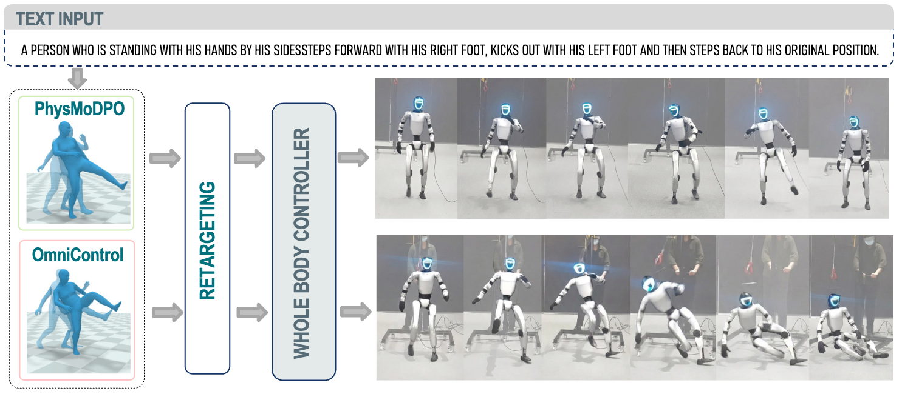

# (arXiv 2026) PhysMoDPO: Physically-Plausible Humanoid Motion with Preference Optimization
This is the official implementation for paper: "PhysMoDPO: Physically-Plausible Humanoid Motion with Preference Optimization".


[[Project Page]](https://mael-zys.github.io/PhysMoDPO/) [[Paper]](http://arxiv.org/abs/2603.13228)





## TODO

- [ ] Finetuning OmniControl with PhysMoDPO
  - [x] Pretraining with SMPL-based data
  - [x] DPO training and evaluation on SMPL character
  - [x] Zero-shot experiments on G1 robot simulation
  - [ ] Zero-shot experiments on H1 robot simulation
- [ ] Finetuning MotionStreamer with PhysMoDPO
  - [ ] DPO training and evaluation on SMPL character
  - [ ] Zero-shot experiments on G1 robot simulation
- [ ] Real robot deployment


## Setup

Clone the repo.
```
git clone git@github.com:Mael-zys/PhysMoDPO.git --recursive
cd PhysMoDPO/
```

### Prerequisites 

- Install TMR (for rewards calculation and H1, G1 robot evaluation) environment and pretrained models according to README in [third-party/TMR](https://github.com/Mael-zys/TMR_PhysMoDPO).

- Install ProtoMotions 2 (for SMPL robot) environment according to README in [third-party/ProtoMotions](https://github.com/Mael-zys/ProtoMotions_SMPL_PhysMoDPO).

- Install ProtoMotions 3 (only for G1 evaluation in simulator) environment according to README in [third-party/ProtoMotions3](https://github.com/Mael-zys/ProtoMotions_G1_PhysMoDPO).

- Install HOVER (only for H1 evaluation in simulator) environment (coming soon).


### OmniControl baseline setup

Please refer to [OmniControl](https://github.com/Mael-zys/PhysMoDPO/tree/master/OmniControl) folder for the detailed installation and the corresponding training and evaluation instructions.

### MotionStreamer baseline setup

Coming soon

## Citation
```
@article{zhang2026PhysMoDPO,
  title={PhysMoDPO: Physically-Plausible Humanoid Motion with Preference Optimization},
  author={Zhang, Yangsong and Muraleedharan, Anujith and Akizhanov, Rikhat and Butt, Abdul Ahad and Varol, G{\"u}l and Fua, Pascal and and Pizzati, Fabio and Laptev, Ivan},
  journal={arXiv},
  year={2026},
}
```

## Related Repos
We adapted some code from other repos in data processing, training, evaluation, etc. Please check these useful repos. 
```
https://github.com/neu-vi/omnicontrol
https://github.com/NVlabs/ProtoMotions/tree/main
https://github.com/Mathux/TMR
https://github.com/nv-tlabs/stmc
https://github.com/NVlabs/HOVER/tree/main
https://github.com/HybridRobotics/whole_body_tracking
``` 